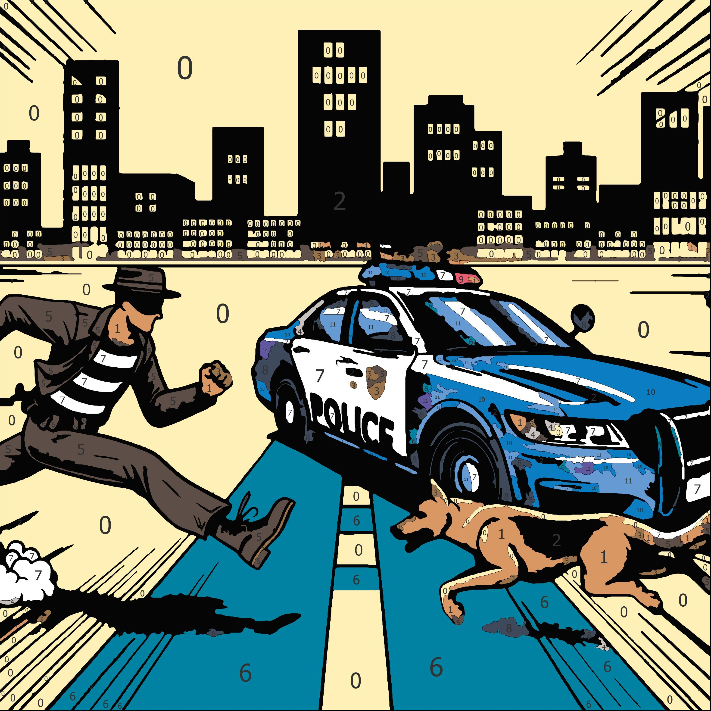

# DALL-E 3 Color-By-Numbers Template Generator

A tool that creates color-by-numbers templates from DALL-E 3 generated images using standard Faber-Castell color palettes. Uses https://github.com/drake7707/paintbynumbersgenerator for template generation.

## Features
- Generates images using DALL-E 3 based on text prompts.
- Converts images into colors-by-numbers style templates.
- Supports multiple official Faber-Castell color palette sizes to match the pencils you may have:
    - 12 colors
    - 24 colors
    - 36 colors
    - 60 colors
    - 72 colors
    - 120 colors

- Creates PDF output with:
    - Fully colored version
    - Outline version with numbers
    - Color reference guide

## Requirements
- Python 3.x.
- OpenAI API key set as OPENAI_API_KEY environment variable.
- Paint by numbers generator Windows executable 

## Installation
1. Clone repository ```git clone https://github.com/calakmul1/dalle-paint-by-numbers```
2. Download paint by numbers generator Windows executable from https://github.com/drake7707/paintbynumbersgenerator/releases/tag/v1.04
3. Unzip executable in the repo under ```./generator/paint-by-numbers-generator.exe```
4. Sign up and get OpenAI API Key from https://openai.com/api/
5. Store OpenAI API Key as environment variable by entering in terminal: ```setx OPENAI_API_KEY "your-actual-api-key-here"```

## Usage

```bash
python main.py -t "your prompt" [-s output_path] [-n number_of_images] [-p palette_size] [-g generator_path]
```

### Arguments
- `-t, --theme`: Required. DALL-E prompt for image generation.
- `-s, --savepath`: Optional. Path to save results. Default: `output`.
- `-n, --number`: Optional. Number of images to generate. Default: `1`.
- `-p, --palette`: Optional. Color palette size (12/24/36/60/72/120). Default: `72`.
- `-g, --generator`: Optional. Path to generator executable. Default: `./generator/paint-by-numbers-generator.exe`.

### Output
For each generated image, the tool creates:
- Original DALL-E image (.jpg)
- Colored version (.jpg)
- Outline version with numbers (.png)
- Color data (.json)
- Complete PDF with all versions and color guide

## Examples
### Firefighter
*Prompt: "A 2D comic style illustration of a firefighter fighting a house fire."*
<p>


### Police Chase
*Prompt: "A 2D comic style illustration of a police car chasing a thief with a dog jumping towards the thief."*
<p>



### Bear
*Prompt: "A bear leaving his cave in the morning."*
<p>


